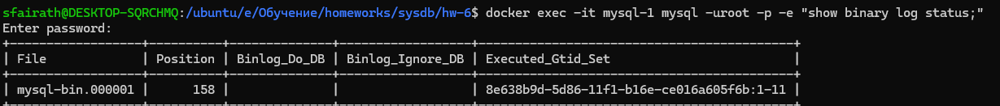
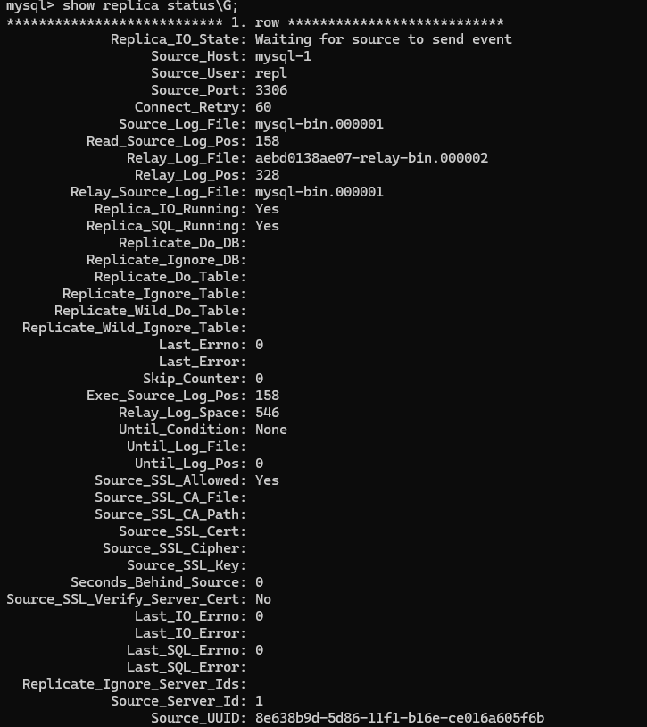

# Домашнее задание к занятию «Репликация и масштабирование. Часть 1»

---

### Задание 1

На лекции рассматривались режимы репликации master-slave, master-master, опишите их различия.

### Решение 1
В режиме master-slave можно писать только в master базу, из slave только читать и slave может только читать из master базы
В режиме master-master можно писать во все базы и они для сохранения целостности данных пишут друг в друга.

---

### Задание 2

Выполните конфигурацию master-slave репликации, примером можно пользоваться из лекции.

### Решение 2
[Конфиг мастера](master.cnf), [конфиг slave](slave.cnf)
 

---

## Дополнительные задания (со звёздочкой*)
Эти задания дополнительные, то есть не обязательные к выполнению, и никак не повлияют на получение вами зачёта по этому домашнему заданию. Вы можете их выполнить, если хотите глубже шире разобраться в материале.